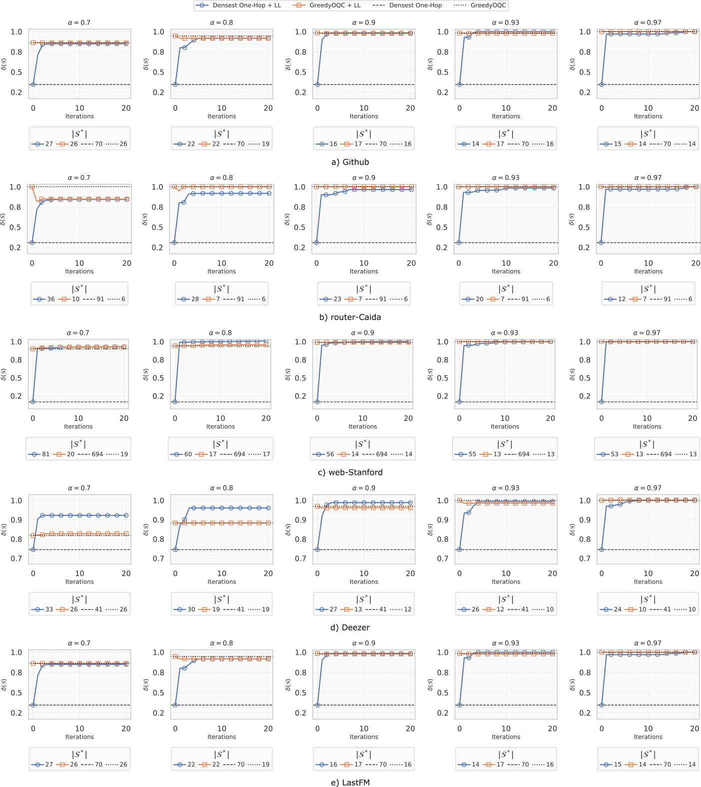
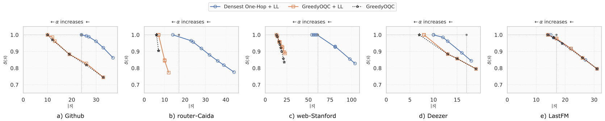

# Dense and Large Subgraph Detection via Lasry-Lions Double Envelopes - A Homotopy Approach

This is a code repository for our submission in "2026 IEEE International Conference on Acoustics, Speech, and Signal Processing (ICASSP)".

## Abstract
Extracting large and dense subgraphs is a key task in graph mining applications. Pre-existing formulations are either overly restrictive (the maximum clique) or yield sparsely connected subgraphs (the densest subgraph problem). The optimal quasi-clique (OQC) problem allows extraction of large cliques and near-cliques of different sizes via a tunable parameter, but is NP-hard, with no principled optimization algorithm known. We propose a novel homotopy-based framework for OQC based on the Lasry-Lions (LL) double envelope that enables efficient approximation via a sequence of smooth subproblems. Experiments on real-world graphs show that our method outperforms the state-of-the-art greedy baseline for OQC, extracting larger and denser (quasi)-cliques that the baseline fails to detect.


## File Arrangement

Here we summarize all files present in this repo and their purpose.
```
+-- datasets/: 
    all the datasets used
+-- logs/: 
    some precomputed logs

+-- LL_optimization.py: 
    implementation of our method
+-- peeling.py: 
    implementation of the GreedyOQC peeling method

+-- run_LL.py:    
    example code to run our method

+-- utils.py: 
    some general utils used
+-- init_graph.py: 
    initialize graph and create protected group

+-- exec_run_LL.sh: 
    bash script example to execute our method with different initializations

+-- plot_delta_iters.ipynb - plot_delta_S.ipynb: 
    jupyter notebooks to reproduce Figure 1 and 2 of the paper
```

## Experimental Results







| Dataset                                | $n$    | $m$    | $\omega$ |
|----------------------------------------|--------|--------|----------|
| Github [[1]](#1)                       | 38K    | 289K   | 24       |
| router-Caida [[2]](#2)                 | 192K   | 609K   | 17       |
| web-Stanford [[3]](#3)                 | 282K   | 1.99M  | 61       |
| Deezer [[4]](#4)                       | 28281  | 92752  | 11       |
| LastFM [[4]](#4)                       | 7624   | 27806  | 15       |

**Table:** Summary of dataset statistics: number of vertices ($n$), number of edges ($m$), maximum clique size ($\omega$).  

---

### References
<a id="1">[1]</a> Benedek Rozemberczki, Carl Allen, and Rik Sarkar, "Multi-scale attributed node embedding," Journal of Complex Networks, vol. 9, no. 2, pp. cnab014, 2021. \
<a id="2">[2]</a> Ryan A. Rossi and Nesreen K. Ahmed, "The network data repository with interactive graph analytics and visualization," in Proc. of AAAI, 2015. \
<a id="3">[3]</a> Jure Leskovec, Kevin J Lang, Anirban Dasgupta, and Michael W Mahoney, "Community structure in large networks: Natural cluster sizes and the absence of large well-defined clusters," Internet Mathematics, vol. 6, no. 1, pp. 29–123, 2009. \
<a id="4">[4]</a> Benedek Rozemberczki and Rik Sarkar, "Characteristic functions on graphs: Birds of a feather, from statistical descriptors to parametric models," in Proceedings of the 29th ACM international conference on information & knowledge management, pp. 1325–1334, 2020.